# Blygger Desktop

A native macOS studio for [Blygger](https://blygger.org) blogs ("blygs"),
built to be as fast as Notational Velocity.

## Install (recommended: one line in Terminal)

```sh
curl -fsSL https://raw.githubusercontent.com/aneeshsathe/blygger-desktop/main/scripts/install.sh | bash
```

This downloads the latest release, checks it against the release's
`SHA256SUMS`, and puts **Blygger.app** in `/Applications`, or in
`~/Applications` if you can't write to `/Applications`. To launch it, run
`open /Applications/Blygger.app` or find it in Spotlight.

Why Terminal? Releases aren't notarized by Apple yet. Files downloaded with
`curl` don't get macOS's quarantine flag, so Gatekeeper doesn't block the app.
The script also clears the flag explicitly, in case a future macOS adds it.

To read the script before running it:

```sh
curl -fsSL -o install.sh https://raw.githubusercontent.com/aneeshsathe/blygger-desktop/main/scripts/install.sh
less install.sh
bash install.sh
```

Or install by hand, verifying the checksum yourself:

```sh
cd "$(mktemp -d)"
base=https://github.com/aneeshsathe/blygger-desktop/releases/latest/download
curl -fLO "$base/Blygger-macos-universal.zip" -fLO "$base/SHA256SUMS"
grep ' Blygger-macos-universal.zip$' SHA256SUMS | shasum -a 256 -c -   # must print "OK"
ditto -x -k Blygger-macos-universal.zip /Applications
open /Applications/Blygger.app
```

Requires macOS 11 (Big Sur) or later, on Apple silicon or Intel.
`BLYGGER_VERSION=0.1.0` installs a specific version, and `BLYGGER_DEST=<dir>`
installs somewhere else.

### Downloading from the Releases page in a browser

The [Releases page](../../releases/latest) has a `.dmg` and a `.zip`. Files
downloaded in a browser are quarantined, and because the app is only ad-hoc
signed (not notarized), macOS blocks the first launch. On macOS 15 (Sequoia)
and later, you see a dialog saying **"Blygger" Not Opened**, with the message
that Apple could not verify it is free of malware, and only **Done** and
**Move to Trash** buttons. Control-click → **Open** no longer gets around this
on macOS 15 and later. To allow it:

1. Drag Blygger to Applications and try to open it once. Click **Done**.
2. Open **System Settings › Privacy & Security** and scroll down to
   **Security**. It says "Blygger" was blocked to protect your Mac. Click
   **Open Anyway**. The button only appears for about an hour after the
   blocked attempt.
3. Confirm with **Open Anyway** in the next dialog and enter your password.
   After that, Blygger opens normally.

Or skip all that with Terminal:
`xattr -dr com.apple.quarantine /Applications/Blygger.app`

On macOS 14 and earlier, Control-click → **Open** → **Open** still works.

## Updates

From 0.3.0 on, Blygger updates itself. About once a day it checks the
[Releases page](../../releases/latest), downloads a new version in the
background, and shows **Blygger X is ready · Restart to update** in the
status bar (quitting installs it too). **Blygger › Check for Updates…** checks
right away.

Updates are signed: the app installs a release only if its `SHA256SUMS` carries
a valid Ed25519 signature from the project's release key (built into the app),
the download matches that file, and the new app is Blygger, newer, and passes
`codesign --verify`. Downloads come only from GitHub, over HTTPS. The one-line
installer checks the same signature when OpenSSL 3 is installed.

`auto-update = notify` in the config only tells you a new version is out, and
`auto-update = off` stops the automatic checks. If Blygger can't replace
itself (say, the folder it's in isn't writable), it says so and links to the
release page.

**On 0.2.0 or earlier?** Those versions can't update themselves. Run the
one-line installer above once more; after that, updates are automatic.

## Disclaimer

> **Blygger Desktop is entirely vibecoded:** it was written with AI assistance.
> It's provided **as is, with no warranty or guarantee of any kind**, and you
> use it **at your own risk**. That includes the risk of losing or corrupting
> posts on your blyg. Keep backups.
>
> THE SOFTWARE IS PROVIDED "AS IS", WITHOUT WARRANTY OF ANY KIND, EXPRESS OR
> IMPLIED, INCLUDING BUT NOT LIMITED TO THE WARRANTIES OF MERCHANTABILITY,
> FITNESS FOR A PARTICULAR PURPOSE AND NONINFRINGEMENT. IN NO EVENT SHALL THE
> AUTHORS OR COPYRIGHT HOLDERS BE LIABLE FOR ANY CLAIM, DAMAGES OR OTHER
> LIABILITY, WHETHER IN AN ACTION OF CONTRACT, TORT OR OTHERWISE, ARISING
> FROM, OUT OF OR IN CONNECTION WITH THE SOFTWARE OR THE USE OR OTHER DEALINGS
> IN THE SOFTWARE. (See [LICENSE](LICENSE).)

## What it is

There's one window: type to search, press ⏎ to create, and nothing ever waits
on the network. It's local-first: everything you write is saved on your Mac
first and synced to your blyg in the background. It's written in Rust with
[GPUI](https://www.gpui.rs), the UI framework behind Zed.


## Features

- **Search is the interface.** The omnibar filters your posts as you type. ↑/↓
  previews each post, ⏎ opens it, and ⏎ with no match starts a new draft.
- **Plain Markdown, no save button.** Every keystroke is saved locally and
  synced shortly after you stop typing.
- **Fragments and threads.** ⌘T switches between them, and a live counter
  keeps fragments within 1000 characters.
- **Publish with a version note** (⌘⏎). Versions, pins and withdrawals follow
  the Blygger protocol, and there are no deletes of published work: ⇧⌘⌫
  deletes a draft or scratch note (it asks first), and Post › Withdraw…
  withdraws a published post, with an optional note.
- **Works offline.** Edits queue up and sync when you're back online. When the
  server changed under you, a side-by-side sheet lets you keep yours, take
  the server's, or keep both.
- **Quick capture.** A global hotkey (⌃⌥B by default) opens a small panel over
  any app. esc, ⌘S or clicking away keeps it as a **scratch note** that stays
  on this Mac (never synced, never published) until you decide: ⌘D makes it a
  draft on your blyg, and ⌘⏎ publishes it. Scratch notes show in the main
  list with a `scratch` pill, are searchable and editable, and ⌘D or ⌘⏎
  there promotes them. `capture-default = draft` makes esc save a draft
  instead, and `new-note = scratch` makes the omnibar create scratch notes.
- **Links.** Select some text and paste a web address to link it, as in
  WordPress: the text becomes `[text](address)`.
- **Images.** Paste or drop an image to upload it; it goes into the text
  where you pasted it, and the preview shows it.
- **Full editor.** A live preview beside the editor shows the post exactly as
  your blyg will publish it, in your blyg's own theme: quotes, AI-written
  spans, video. ⌘1 writes, ⌘2 adds the preview, ⌘3 hides the list, ⌘E toggles
  the preview. Click a paragraph in the preview to jump to it.
- **Buttons or keyboard.** A quiet toolbar in the title bar (New, Make draft,
  Publish, Write / Preview / Full editor, Versions, Generate, Delete or
  Withdraw, Quick capture),
  and a Scratch · Draft · Publish row in quick capture. Every tooltip shows
  the shortcut, so the buttons teach the keys, and a greyed-out button says
  why ("Too long for a fragment. ⌘T makes it a thread"). Narrow windows get
  icons only. `show-buttons = false` (or Settings ⌘,) gives the keyboard-only
  window.
- A Tufte-style light and dark theme, and
  switchable writing and UI fonts (Literata, Inter, Source Serif 4, iA Writer
  Quattro and ET Book are bundled).
- **AI helpers, with disclosure.** Fill a `[TK]` gap, shorten a post to fit,
  continue a thought, outline a thread, or proofread. Generation happens at
  writing time, you review it, and generated text is always disclosed.
- **Profiles.** ⌘I on a post (or a click on its author's address, its
  "↳ stub of" / "⑂ forked from" line, a mention, or a blogroll entry) shows
  who wrote it: name, bio, links, their blogroll, recent posts, and the blygs
  they quote, stub and fork. Follow in one click (private; nobody is told),
  or add them to your own public blogroll. ⇧⌘O opens any address. Profiles are
  fetched from the blyg's public files without your token, only when you open
  one, and kept for offline use. There are no follower counts anywhere.

| | |
|---|---|
| 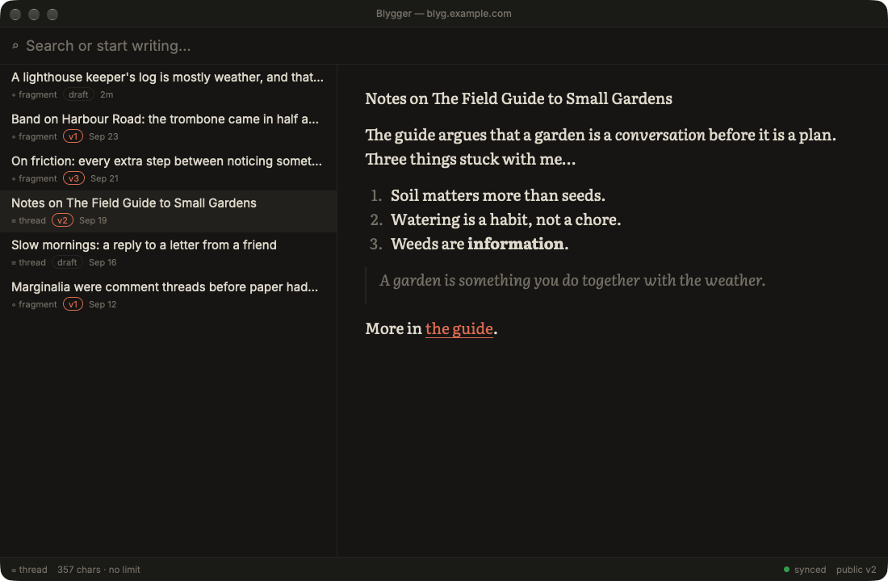 | 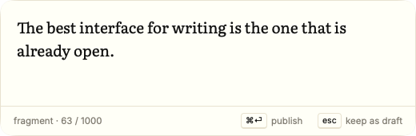 |
| 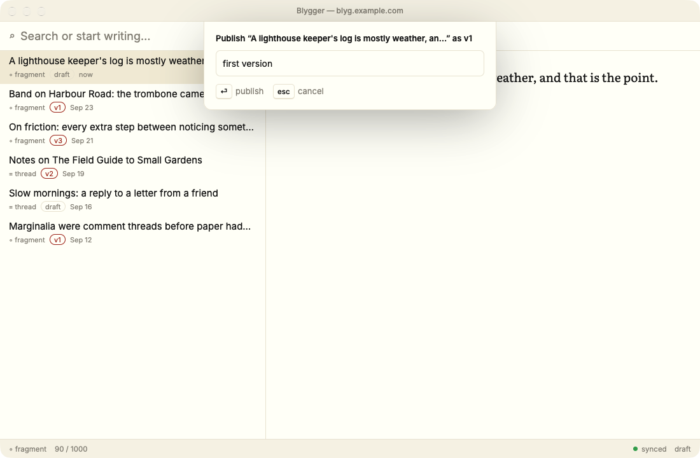 | 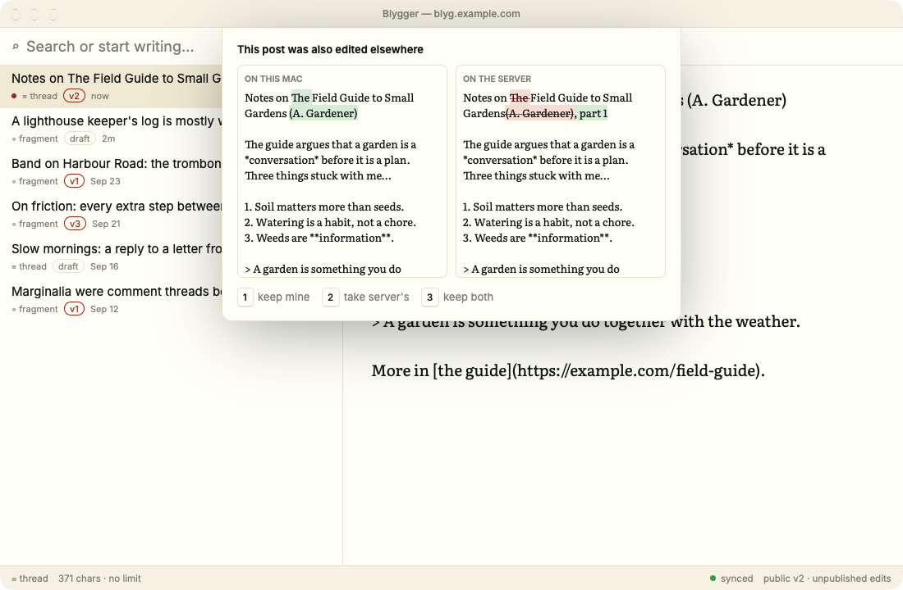 |
| 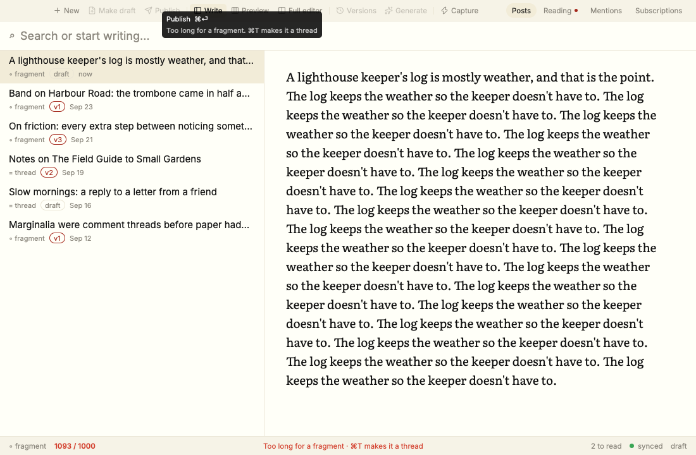 | 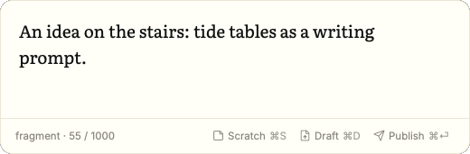 |
| 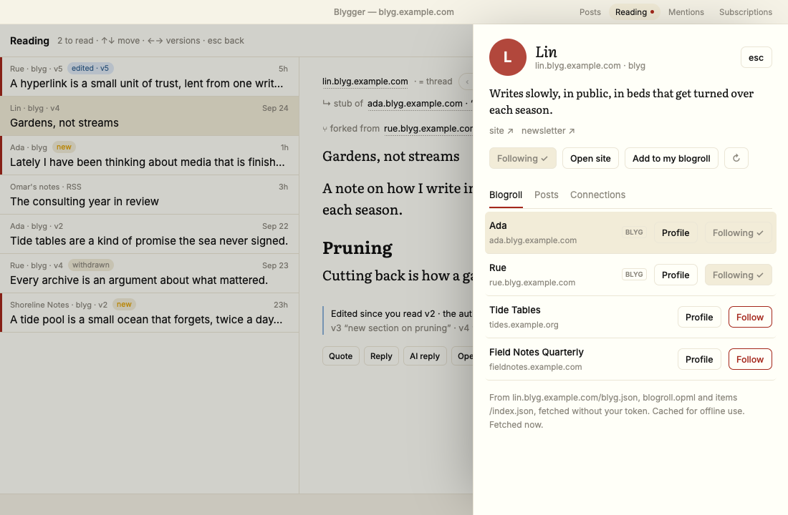 | 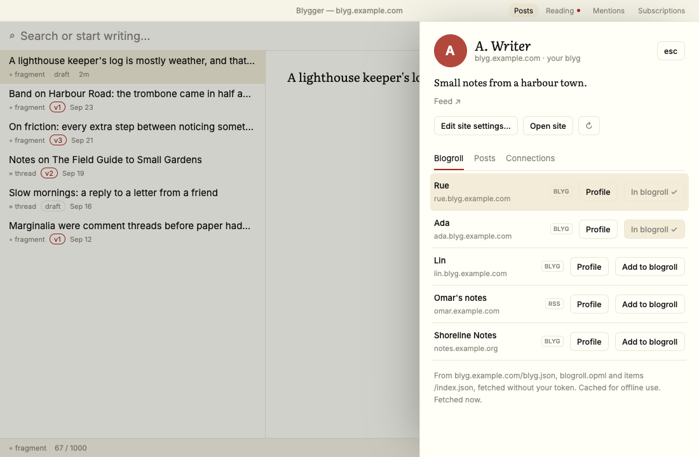 |

## Requirements: a blyg the app can talk to

> **Heads-up:** Blygger Desktop currently needs server features that aren't in
> upstream Blygger yet.

The app talks to your blyg through its owner API. Today that means a Blygger
Worker with four small, additive extensions:

1. **Bearer-token owner auth.** Upstream uses a browser cookie session.
2. **JSON reads** for your items and subscriptions.
3. **Read extensions** for the reading list, mentions, settings and hoppers.
4. **Client-recorded AI provenance**, so text generated in the app is disclosed
   like text the server generates.

These aren't in upstream Blygger yet. The plan is to propose them there. Details,
contracts and what the app does without each one: [`docs/SERVER.md`](docs/SERVER.md).
In short, a missing extension turns that feature off rather than breaking the app.
Without #4, the app warns before publishing AI-generated text undisclosed.

To try the UI without a server, run it on built-in sample data (see
[Building from source](#building-from-source)).

## First launch

The first launch opens a short setup: a welcome, **Connect your blyg** (or
*Skip, just try it with sample data*), **AI** (off until you switch a provider
on; installed `claude` / `codex` CLIs are detected), and **Buttons or
keyboard?** (`show-buttons`). esc skips it at any step. Then comes an optional
**interactive tour** of the real window: each step highlights a part of it and
waits for you to press the key (⌘T, ⌘⏎, ⌘3, ⌘G, ⌘Y, ⌘R, ⌘K…). The tour runs on
sample data, so your own blyg isn't touched, and your posts come back when it
ends. Replay it from **Help › Blygger Tutorial** or **Settings (⌘,) › Help**,
or set `tutorial-on-launch = true` to see it every time.

| | |
|---|---|
| 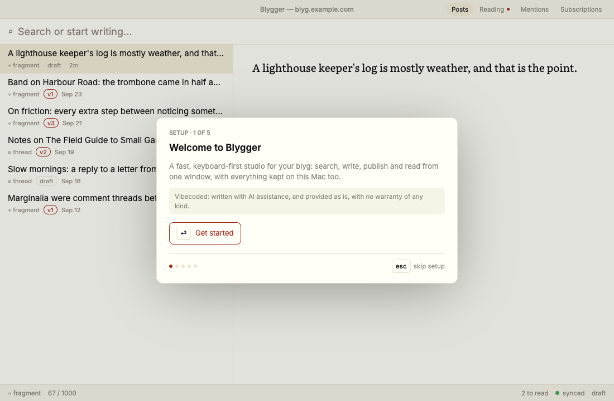 | 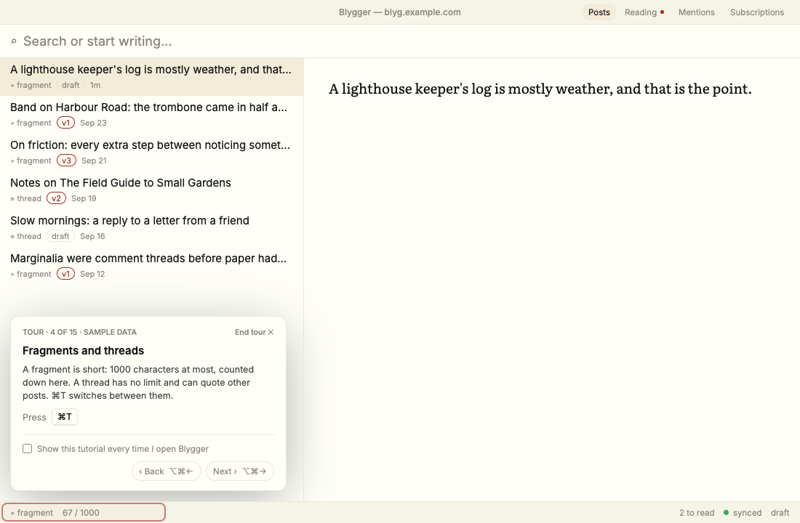 |

## Connecting your blyg

The Connect step asks for your blyg's address and its owner token (the
Worker's `BLYG_OWNER_TOKEN` secret). It checks them with the server before
saving anything, and says plainly what's wrong: the address can't be reached,
the token is wrong (401), or the server lacks the owner-API extensions (404).
The token then goes in your Keychain and the address into the config file as
`blyg-url`, and the app loads your posts. **Blygger › Disconnect…** forgets
both, and can also delete the local copy.

| | |
|---|---|
| 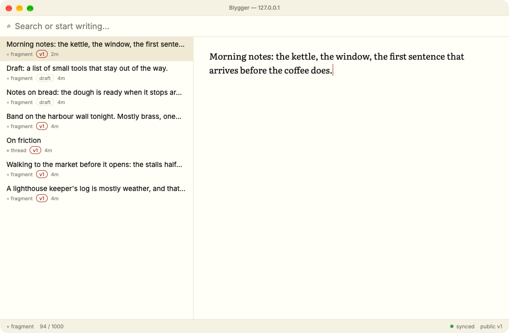 | 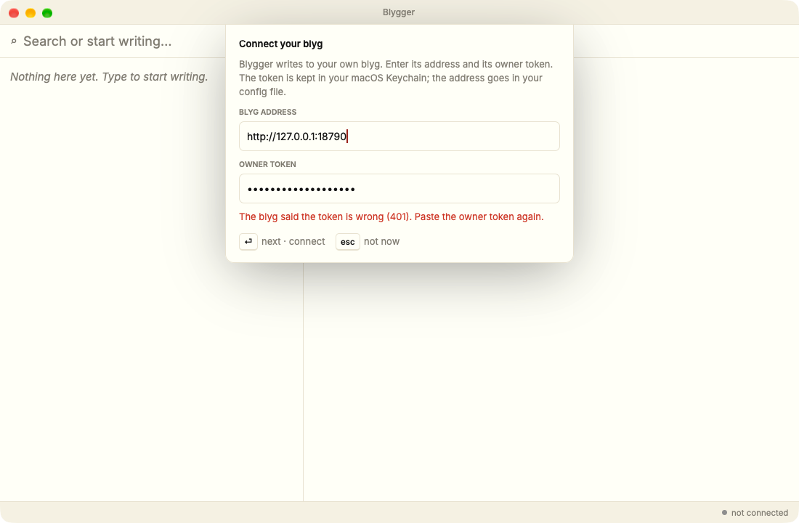 |

## Configuration

Settings live in a plain-text file in the style of Ghostty's config:
`~/.config/blygger/config`, with one `key = value` per line. Every option is
optional. To list every option with its default and documentation:

```sh
/Applications/Blygger.app/Contents/MacOS/blygger +show-config --default --docs
```

Most options can also be changed in Settings (⌘,).

**Secrets never go in this file.** The blyg owner token and AI API keys are
stored in the macOS Keychain, and the app never logs them.

## AI providers

AI is optional and **off until you turn it on**: Blygger uses no provider, not
even an installed `claude` or `codex` CLI, until you enable one (`ai-enable` in
the config file) or sign in to one in Settings. You use your own accounts:

| Provider | How you sign in |
|---|---|
| Anthropic API | API key (stored in the Keychain) |
| OpenAI API | API key (stored in the Keychain) |
| Cloudflare Workers AI | Account ID and API token. Defaults to Gemma 4. |
| Local Claude Code or Codex | Uses your installed `claude` or `codex` CLI and whatever account it's signed in to |
| Your blyg server | Its `/generate` endpoint, if enabled |
| ChatGPT account | Sign in with ChatGPT. **Unofficial:** this uses the same sign-in as OpenAI's Codex CLI, which OpenAI doesn't offer to third-party apps. It may break or be blocked at any time. |

### Connecting and generating

1. Turn a provider on. Either open **Settings › AI** (⌘, then "AI accounts…")
   and switch on Claude Code or Codex, paste an API key, or sign in, or add it to
   the config file:

   ```
   ai-enable = codex
   ai-enable = claude-code
   ai-provider = codex        # which one ⌘G uses (optional)
   ```

   API keys go straight to the Keychain and are never shown again: Settings
   shows "key saved" and a Remove button.
2. In a post, write a gap: `[TK]one sentence on why, in my voice[/TK]`.
3. With the caret inside it, press **⌘G**. The status bar shows
   `generating… (codex)`; **esc** cancels. The answer is written in place as
   `[TK]instruction[=]output[/TK]`. Press ⌘G inside it again to regenerate.

⌘G anywhere else opens the helpers: fill a gap here, shorten to fit 1000
(also **⇧⌘G**; you see a diff and accept or reject it), continue this thought,
outline a thread, and proofread (typos and grammar only, as suggestions).

Generated text is always disclosed as generated when you publish. Blygger
records which model wrote each gap and sends it to your blyg with the text
(the provenance extension in `docs/SERVER.md`). If your blyg doesn't have
that extension, Blygger warns you before publishing generated text, and
Cancel is the default. Proofreading isn't generated prose and isn't disclosed.

**Not offered:** signing in with a claude.ai (Pro/Max) subscription.
Anthropic's terms don't allow third-party apps to use claude.ai logins. To use
a Claude subscription, install Claude Code and pick the local Claude Code
provider.

## Building from source

You need macOS and Rust via [rustup](https://rustup.rs). The toolchain version
is pinned in `rust-toolchain.toml` and installs automatically.

```sh
git clone <this repository> && cd blygger-desktop
BLYGGER_FAKE=1 cargo run -p blyg-app --release   # the full UI on sample data, no server
cargo test --workspace
```

End-to-end tests run blyg-core against a real Worker under `wrangler dev
--local` (never a deployed blyg). Point them at a Worker checkout that carries
the extensions in `docs/SERVER.md` (run `npm install` there first):

```sh
BLYG_WORKER_DIR=/path/to/worker scripts/e2e-local.sh
```

To build the app bundle, zip and dmg in `dist/`:

```sh
rustup target add x86_64-apple-darwin   # only for universal builds
scripts/bundle.sh                        # universal (the default)
scripts/bundle.sh --arch arm64           # this Mac's architecture only
```

`scripts/bundle.sh` signs ad-hoc unless Developer ID credentials are set in
the environment. With them, it signs, notarizes and staples the app and the
dmg. `scripts/sign.sh` documents the variables. Releases are built by
`.github/workflows/release.yml` when a `v*` tag is pushed. Each release has
versioned assets (`Blygger-0.1.0-macos-universal.zip` and `.dmg`),
version-less copies (`Blygger-macos-universal.zip` and `.dmg`, which the
`releases/latest/download/…` URLs point to), and `SHA256SUMS`.

## License

Different parts of the project are under different licenses:

| What | License |
|---|---|
| Source code (everything not listed below) | [MIT](LICENSE) |
| Documentation, design mockups and screenshots (`docs/`), and the icon and artwork (`packaging/icon.svg`, `packaging/Blygger.icns`) | [CC BY 4.0](LICENSE-docs). Reuse is fine with credit to "Blygger Desktop contributors". |
| Bundled fonts (`crates/blyg-app/assets/fonts/`) | Their own licenses: Literata, Inter, Source Serif 4 and iA Writer Quattro are under the SIL Open Font License 1.1, and ET Book is under MIT |

The license texts ship inside the app bundle. See
[packaging/THIRD_PARTY.md](packaging/THIRD_PARTY.md) for the fonts and the
Rust dependencies' licenses.
